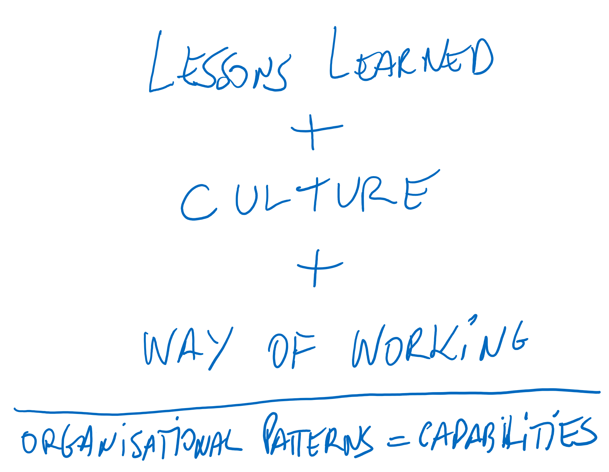
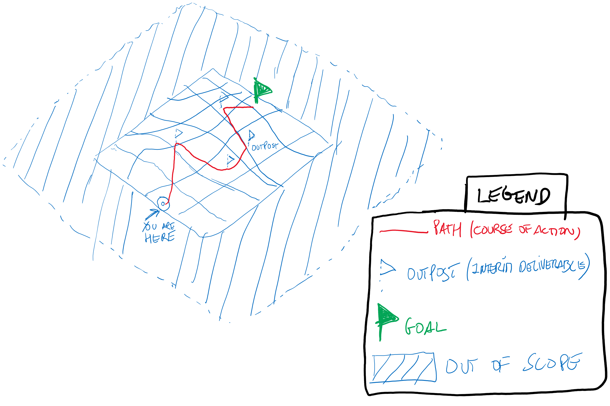
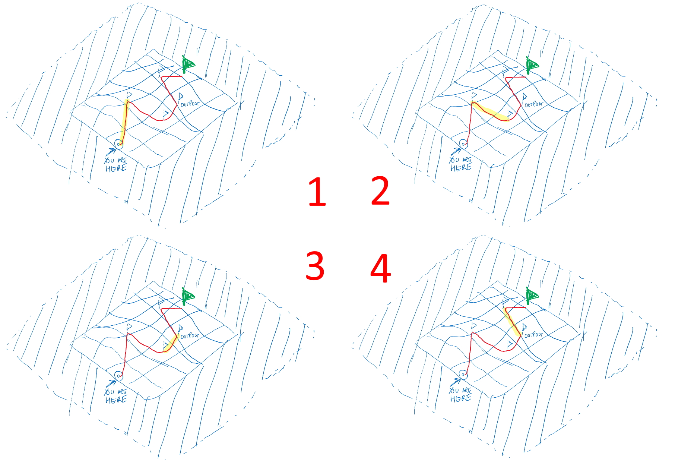

# General Overview

> “Plans are nothing. Planning is everything.”

Dwight Eisenhower, 34th President of the United States

According to the PMBoK, every project is a:

> “temporary endeavour undertaken to create a unique product, service or result”.

PMBOK® Guide – Sixth Edition (2017)

Bearing this in mind, in order to create or deliver the output, there is a need to structure the way (the ‘how’) to do it, that is, given the inputs (resources, either physical or informational - such as requirements, or manpower or specific tools, etc.) that need to be transformed into the desired outputs through transformation.

All this needs to be carefully identified, defined and controlled to ensure not only that it delivers the actual output as intended (‘efficacy’ or ‘doing the right thing’) but also with the right amount of resources to achieve it (‘efficiency’ or ‘doing things right’) - ideally, no more, no less.

And that is where planning comes in.

Planning is something that requires thoughtful, critical and dedicated thinking while keeping an open mind regarding uncertainty and all the dynamics from the context that it’s inserted in. Naturally, the keyword is its dynamic nature (verb intended) as opposed to static - once a plan is captured and documented (several artifacts can be used to make it up, such as WBS, activity list and gantt chart, among others), we need to frame it as a baseline for once things get moving.

We cannot mistake the essence and the actual value of planning with the tool that we use to achieve it, since it should be assumed and accepted that planning (or plans as a result of the effort of planning) will change and evolve once we start executing it - not to be feared.

Also to bear in mind is that, not only will planning evolve and change over time, but also that it needs to constantly do so as its own process. This means that planning must occur continuously through a constant effort.

And why?

Because planning is focused on preparing for the execution of something that occurs in reality, and reality is governed by multiple and interrelated variables, themselves evolving and changing, and so, in this context, we need to adapt to these changing circumstances as we go along. Reality is a moving target and so we cannot stand still while navigating through it.

And here lies the complexity. Think of it as *“trying to build a plane in mid-air”*.

**Recap:**

* It’s a verb *(planning)*, not a noun *(plan)*;

* The nature of planning is dynamic - environment and their variables are changing;

* It’s a constant effort throughout the project;

* Do not mistake the medium for the message - it’s not the plan in itself that matters but the layout to the direction towards the outcomes, hence the need to have a baseline to compare to once things get moving;

## What constitutes planning and how can we built one

Let’s first go over the dimensions and elements of planning while also detailing its own process where it unfolds.

Planning is one of the phases or process groups (as depicted in the PMBoK), that is it has sufficient importance, is critical to quality and has complexity to have a dedicated set of processes within every project, since it gives an answer to the ‘how to do it’ question.

Although the process itself, the artifacts that are generated and the level of effort spent by human and financial resources differ according to the project type, budget and risk profile, it must be present in order to properly manage the project - the key issue here is to tailor the process according to these project characteristics.

So, in essence, *planning is the art of drawing a roadmap towards the objective(s) set out for the project.*

This roadmap is an exercise that starts with idea storming, in a collective manner bringing multi-perspective and angles that will allow for a more creative and enriched exercise. It will then be captured into a document (text, visual or some other form). Hard and critical thinking goes into it, bringing along:

* the experience from similar undertakings - the lessons learned;

* the embedded culture from the specific settings where the project will develop - the shared attitudes and values of the organisation,

* the way of working translated into methods and practices that the undertaking can benefit from, such as processes, policies, guidelines that can help tailoring our roadmap.

The common thread of all this 3 items are patterns - information transformed into captured knowledge that allows us to understand the organisational capabilities.

The **roadmap** is made up of:

* the *objectives must be clear and explicit from the start* (where we are running towards or, more technically, the strategic domain) and what the expected outcomes will be. These become the targets to achieve and where all the energy must be directed to;

* the *scope* of the undertaking (the limits of our terrain) where we identify all the needed skills and expertise to carry out the initiative that is translated then into resources and effort that will be put into it to obtain the *outcomes* - that is, we need to know, and constantly refine, the boundaries of what falls under the work to be done and what does not;

* the *course of action* that we need to take in order to keep focus on what we need to obtain - since we’re refining the objectives that ultimately lead to the outcomes and keeping score of what is in our scope, we also need to keep adjusting the path along the way in terms of both strategic and tactical decisions.

The roadmap is a tool that enables us to have a bird’s eye view of what, how and where we are going, which is the start for us to really begin to detail and move into the tactical domain.

The tactical approach, spearheaded by program/project management as a method to handle initiatives or needed changes, is to tackle the complexity and breadth of the objective(s) and scope. This means that one needs to decide if there is a need to breakdown the scope into several projects that are interrelated and dependent (program approach) or if a large major project will be the best option to obtain synergies.

The complexity, level of risk, effort and skills needed might justify breaking down the initial path into smaller ones (into 4 as our example above) and chart a project for each one.

However, if we decide to do it, the program view becomes essential in order to coordinate and ensure that all that we can take advantage from each project is shared along with the other: such as decisions that proved to increase risk or turn out to be wrong, or a specific method or approach that one of the projects followed and proved to be more efficient.

Apart from this, we need to ensure that the goal is still the objective for all these smaller projects to obtain, not losing focus or sight.

**Recap:**

* Planning is process that fits into the overall process groups that make up a project;

* Being a process, it can be performed/executed at every time it needs to (not just at the beginning of the project);

* The purpose of planning is to design a roadmap that leads to the project’s goal and objectives;

* It benefits from 3 key items: *lessons learned*, the *culture* in which the project will be performed and the *way of working* of the organisation performing it;

* It’s the moment where we move from strategic to tactical perspective, detailing how we are going to achieve our goal and objectives.